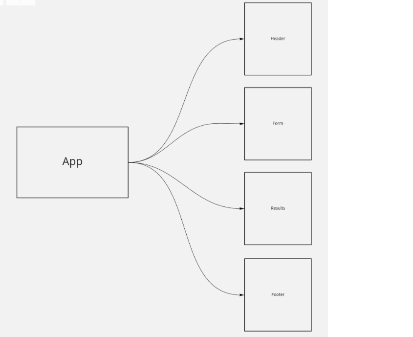

# RESTy

### Our application will be an API testing tool that can be run in any browser, allowing a user to easily interact with APIs in a familiar interface.

- Phase 1: Application Setup
```
Basic React Application
Scaffolding
Basic State
Rendering
```

* SandCode:

[Link to SandCode](https://codesandbox.io/s/infallible-brook-3s914)

* UML :


